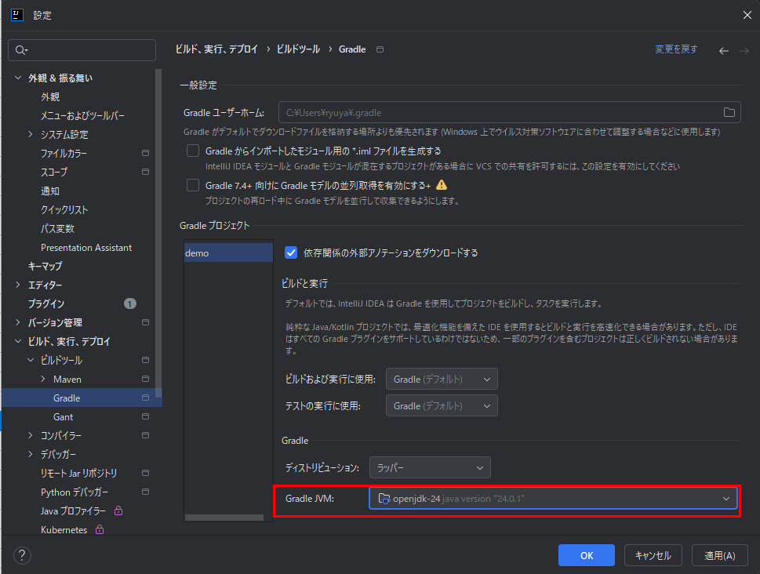
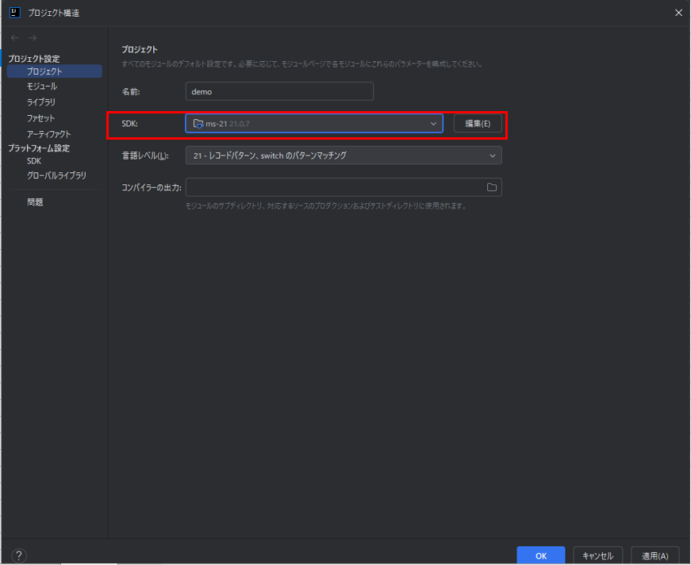

# spring-boot-demo

[TOC]

## ドキュメント

spring 公式ガイド
https://spring.io/quickstart

FW 作成
https://start.spring.io/

## 設定

build.gradle javaバージョン 21
プロジェクト構造 SDKバージョン 21
Gradle バージョン 21

## 確認用URL

http://localhost:8080/hello

## エラー

### エラー 1

```
Caused by: org.gradle.jvm.toolchain.internal.install.exceptions.ToolchainProvisioningException: Cannot find a Java installation on your machine (Windows 11 10.0 amd64) matching: {languageVersion=24, vendor=any vendor, implementation=vendor-specific}. Toolchain download repositories have not been configured.
	at org.gradle.jvm.toolchain.internal.install.DefaultJavaToolchainProvisioningService.tryInstall(DefaultJavaToolchainProvisioningService.java:103)
	at org.gradle.jvm.toolchain.internal.JavaToolchainQueryService.downloadToolchain(JavaToolchainQueryService.java:217)
	at org.gradle.jvm.toolchain.internal.JavaToolchainQueryService.lambda$query$2(JavaToolchainQueryService.java:187)
```

下図箇所のバージョンをエラー内容のバージョンにする。
JDK のインストールも同じ場所から可能


### エラー 2

```
現在、ビルドは互換性のない Java 24.0.1 と Gradle 8.13 を使用するように構成されています。プロジェクトを同期できません。

互換性のある Gradle JVM の最大バージョンは 21 です。

```

エラー 1 と同じ個所を 21 に下げることで解決

### エラー 3

```
java.lang.UnsupportedClassVersionError: com/example/demo/DemoApplication has been compiled by a more recent version of the Java Runtime (class file version 68.0), this version of the Java Runtime only recognizes class file versions up to 62.0
```



| class file version | Java バージョン |
| ------------------ | --------------- |
| 62.0               | Java 18         |
| 63.0               | Java 19         |
| 64.0               | Java 20         |
| 65.0               | Java 21         |

SDK が 18 になっていたので 21 に変更
